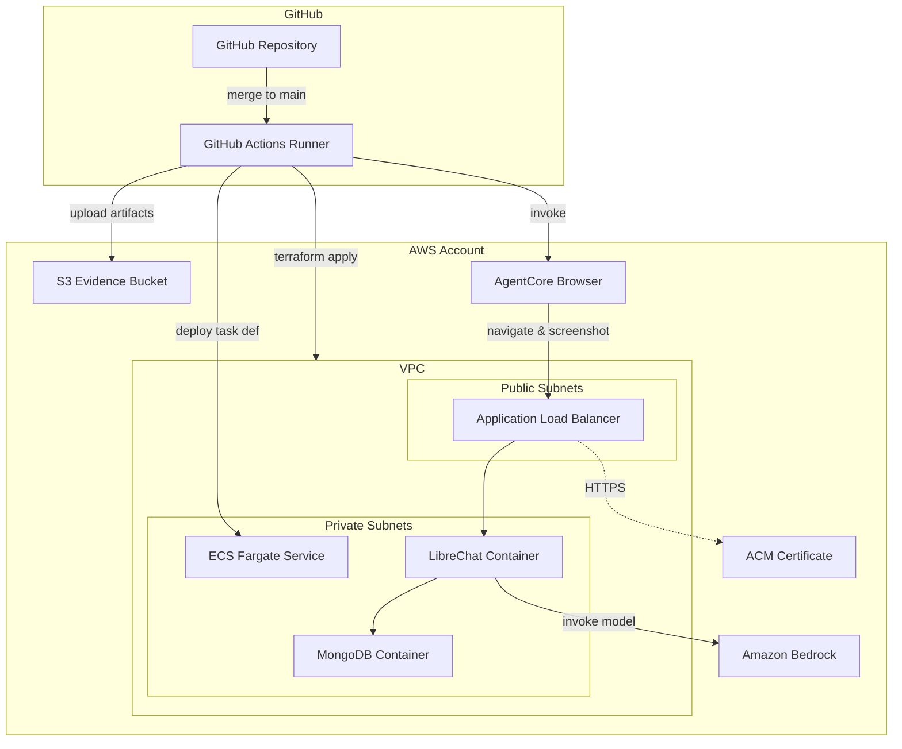
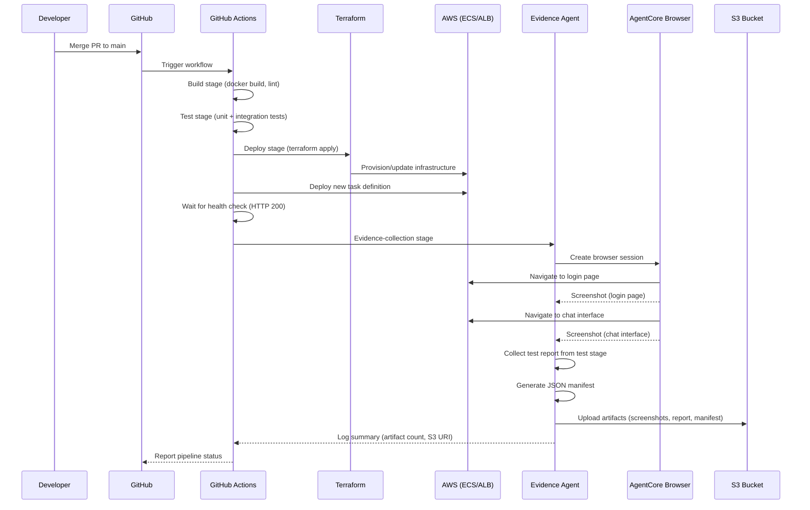

# Design Document: Evidence Pipeline Chat App

## Overview

This design describes a simple, single-environment (dev) CI/CD evidence collection pipeline. The user's GitHub repository is a **fork of [danny-avila/LibreChat](https://github.com/danny-avila/LibreChat)**, which means the repo contains the full LibreChat source code alongside the evidence-pipeline additions (`evidence_agent/`, `terraform/`, `.github/workflows/evidence-pipeline.yml`, and `librechat.yaml`). The LibreChat application is built from this fork using LibreChat's own Dockerfile, allowing full customisation of the chat application in the future.

A GitHub Actions pipeline automates build/test/deploy/evidence-collection on merge to main, and a Python-based Evidence Agent uses Amazon Bedrock AgentCore Browser to capture screenshots and test reports, storing them in S3.

There is no multi-environment setup — the pipeline targets dev only, keeping the Terraform configuration lean and the workflow straightforward.

The system has five major components:

1. **LibreChat Application** — Built from the forked LibreChat source and deployed as a Docker container on AWS ECS Fargate behind an ALB, configured to use Amazon Bedrock models as its AI/LLM backend
2. **Terraform Configuration** — IaC defining all AWS resources (VPC, ECS, ALB, S3, IAM)
3. **GitHub Actions Pipeline** — Simple dev workflow triggered on merge to main
4. **Evidence Agent** — Python script using AgentCore Browser + Playwright for screenshot capture
5. **S3 Artifact Store** — Organized bucket for evidence artifacts with JSON manifests

### Key Design Decisions

- **Fork of danny-avila/LibreChat**: The user's GitHub repository is a fork of the upstream LibreChat project. This means the repo contains the full LibreChat source code, and the CI/CD pipeline builds the Docker image using LibreChat's own multi-stage Dockerfile. The fork approach allows future customisation of the chat application (UI changes, plugin additions, etc.) while still being able to pull upstream updates. Evidence-pipeline-specific code (`evidence_agent/`, `terraform/`, `.github/workflows/`, `librechat.yaml`) lives alongside the LibreChat source in the same repository.
- **ECS Fargate over EC2**: LibreChat runs as Docker containers. Fargate eliminates instance management and aligns with the containerized deployment model. LibreChat requires MongoDB, which runs as a sidecar container in the same task definition for simplicity.
- **Amazon Bedrock as LLM backend (cross-region inference)**: LibreChat natively supports Amazon Bedrock as an endpoint. Using Bedrock avoids managing model infrastructure and provides access to a range of foundation models via IAM-based authentication — no API keys to manage. Since the application is deployed in `ap-southeast-1`, cross-region (global) inference is used to access models not natively available in that region. Model IDs use the region-prefixed format (e.g., `us.anthropic.claude-3-5-sonnet-20241022-v2:0`) which routes requests to the appropriate region transparently.
- **ALB with HTTPS**: An Application Load Balancer provides a stable public endpoint with TLS termination via ACM, satisfying the HTTPS requirement.
- **Single dev environment**: The pipeline targets a single dev environment only — no staging or production stages. This keeps the Terraform configuration and pipeline simple and focused on demonstrating evidence collection.
- **AgentCore Browser over Selenium/Puppeteer**: AgentCore Browser provides managed, isolated Chrome sessions with built-in observability, session replay, and no infrastructure to manage. It integrates with Playwright for programmatic control.
- **Python for Evidence Agent**: The `bedrock-agentcore` SDK is Python-native, and Playwright has first-class Python support.

## Architecture



### Data Flow



## Components and Interfaces

### 1. LibreChat Application

The user's GitHub repository is a fork of [danny-avila/LibreChat](https://github.com/danny-avila/LibreChat). The Docker image is built from this fork using LibreChat's own multi-stage Dockerfile, which produces a production-ready Node.js image. The `librechat.yaml` configuration file lives at the repository root and is included in the image during the build. This fork-based approach allows full customisation of the LibreChat source while keeping the ability to merge upstream updates.

The application is deployed as a Docker container on ECS Fargate. It provides the web-based chat interface that serves as the target for evidence collection. LibreChat is configured to use Amazon Bedrock as its AI/LLM backend via its native Bedrock endpoint support.

**Container Configuration:**
- Image: Built from the forked LibreChat source (pushed to ECR)
- Port: 3080 (default LibreChat port)
- Environment variables: MongoDB connection string, app secrets, `AWS_DEFAULT_REGION` (set to `ap-southeast-1` for Bedrock API calls via cross-region inference)
- Health check: `GET /api/health` returning HTTP 200

**Bedrock Model Configuration (`librechat.yaml`):**
LibreChat's `librechat.yaml` configuration file is used to define the Bedrock endpoint and available models. This file lives at the repository root and is baked into the Docker image during the build (LibreChat's Dockerfile copies it to `/app/librechat.yaml`).

```yaml
# librechat.yaml — Bedrock endpoint configuration (cross-region inference)
endpoints:
  bedrock:
    enabled: true
    availableRegions:
      - ap-southeast-1
    models:
      default:
        - us.anthropic.claude-3-5-sonnet-20241022-v2:0
        - us.amazon.nova-micro-v1:0
      fetch: false
    titleModel: "us.anthropic.claude-3-5-sonnet-20241022-v2:0"
    summarize: true
    summaryModel: "us.anthropic.claude-3-5-sonnet-20241022-v2:0"
```

> **Note:** Model IDs use the cross-region inference format (`us.` prefix) to access models via global inference profiles. This allows the application in `ap-southeast-1` to invoke models hosted in US regions transparently.

LibreChat uses the AWS SDK internally and authenticates to Bedrock via the ECS task role's IAM credentials (no API keys required).

**MongoDB Sidecar:**
- Image: `mongo:7` 
- Runs as a sidecar container in the same ECS task definition
- Data stored on EFS for persistence across task restarts

### 2. Terraform Configuration

All infrastructure is defined in Terraform with the following module structure:

```
terraform/
├── main.tf              # Root module, provider config
├── variables.tf         # Input variables
├── outputs.tf           # Output values (ALB URL, S3 bucket name)
├── versions.tf          # Provider version constraints
├── modules/
│   ├── networking/       # VPC, subnets, security groups
│   │   ├── main.tf
│   │   ├── variables.tf
│   │   └── outputs.tf
│   ├── compute/          # ECS cluster, task def, service, ALB
│   │   ├── main.tf
│   │   ├── variables.tf
│   │   └── outputs.tf
│   └── storage/          # S3 evidence bucket, EFS
│       ├── main.tf
│       ├── variables.tf
│       └── outputs.tf
```

**Key Resources:**
| Resource | Purpose |
|---|---|
| `aws_vpc` | Isolated network for the application |
| `aws_ecs_cluster` | Fargate cluster for container orchestration |
| `aws_ecs_task_definition` | LibreChat + MongoDB container definitions |
| `aws_ecs_service` | Desired count, load balancer attachment |
| `aws_lb` | Public-facing ALB with HTTPS listener |
| `aws_acm_certificate` | TLS certificate for HTTPS |
| `aws_s3_bucket` | Evidence artifact storage |
| `aws_efs_file_system` | Persistent storage for MongoDB data |
| `aws_iam_role` | Task execution role, task role with S3 write access and Bedrock invoke permissions (including cross-region inference profile access) |

**Parameterized Variables:**
- `aws_region` (default: `ap-southeast-1`)
- `instance_size` — maps to Fargate CPU/memory (e.g., `small` = 0.5 vCPU / 1GB)
- `s3_bucket_name` — configurable evidence bucket name
- `project_name` (default: `evidence-pipeline-chat-app`) — used as a prefix for resource naming and tagging

All resources are tagged with `environment = "dev"` as a hardcoded value. There is no multi-environment variable — this pipeline targets dev only.

### 3. GitHub Actions Pipeline

The pipeline is defined in `.github/workflows/evidence-pipeline.yml` as a single dev workflow with four sequential jobs:

```yaml
# Simplified dev pipeline
name: Evidence Pipeline (Dev)
on:
  push:
    branches: [main]

jobs:
  build:
    # Docker build, lint
  test:
    needs: build
    # Unit tests, produce JUnit XML
  deploy-dev:
    needs: test
    # terraform apply to dev, ECS deploy, health check
  evidence:
    needs: deploy-dev
    # Run Evidence Agent, upload to S3
```

**Stage Details:**

| Stage | Actions | Outputs |
|---|---|---|
| **build** | Verify `librechat.yaml` present, Docker build from fork's Dockerfile, push to ECR, lint | Container image tag |
| **test** | `pytest` / `npm test`, generate JUnit XML | `test-results/report.xml` |
| **deploy-dev** | `terraform apply` (dev), ECS service update, health check poll | Application URL |
| **evidence** | Run Evidence Agent Python script | S3 URI of artifacts |

**Secrets Required:**
- `AWS_ACCESS_KEY_ID` / `AWS_SECRET_ACCESS_KEY` (or OIDC role ARN)
- `AWS_REGION`
- `S3_BUCKET_NAME`
- `TERRAFORM_BACKEND_BUCKET` (for state storage)

**Failure Handling:**
Each job uses `needs:` to enforce sequential execution. If any job fails, subsequent jobs are skipped automatically by GitHub Actions. The workflow uses `if: failure()` steps to annotate the failure in the Actions UI.

### 4. Evidence Agent

A Python script (`evidence_agent/main.py`) that orchestrates screenshot capture and artifact upload.

**Dependencies:**
- `bedrock-agentcore` — AgentCore Browser SDK
- `playwright` — browser automation (used via AgentCore Browser's Playwright integration)
- `boto3` — S3 upload
- Python 3.10+

**Module Structure:**
```
evidence_agent/
├── main.py              # Entry point, orchestration
├── browser.py           # AgentCore Browser session management
├── screenshots.py       # Page navigation and screenshot capture
├── artifacts.py         # S3 upload, manifest generation, key formatting
├── config.py            # Configuration from env vars
└── requirements.txt
```

**Key Interfaces:**

```python
# artifacts.py
def build_s3_key_prefix(run_id: str, timestamp: datetime) -> str:
    """Build S3 key prefix: evidence/{run_id}/{iso_timestamp}/"""
    ...

def generate_manifest(artifacts: list[ArtifactEntry]) -> dict:
    """Generate JSON manifest listing all artifacts with metadata."""
    ...

def upload_with_retry(
    s3_client, bucket: str, key: str, body: bytes, max_retries: int = 3
) -> None:
    """Upload to S3 with exponential backoff retry."""
    ...

# browser.py
def create_browser_session(app_url: str, timeout: int = 60) -> BrowserSession:
    """Create AgentCore Browser session targeting the app URL."""
    ...

# screenshots.py
def capture_page_screenshot(page, page_name: str) -> ScreenshotResult:
    """Navigate to page and capture full-page screenshot."""
    ...
```

**AgentCore Browser Integration:**
The Evidence Agent uses the `bedrock-agentcore` SDK to create a managed browser session. The session provides a Playwright-compatible browser context connected to a remote Chrome instance managed by AWS.

```python
from bedrock_agentcore.tools.browser_client import browser_session
from playwright.sync_api import sync_playwright

with browser_session() as session:
    playwright = sync_playwright().start()
    browser = playwright.chromium.connect_over_cdp(session.cdp_endpoint)
    context = browser.contexts[0]
    page = context.pages[0]
    
    page.goto(app_url)
    page.screenshot(path="login.png", full_page=True)
```

### 5. S3 Artifact Store

**Bucket Structure:**
```
s3://{bucket_name}/
└── evidence/
    └── {run_id}/
        └── {iso_timestamp}/
            ├── screenshots/
            │   ├── login-page.png
            │   └── chat-interface.png
            ├── reports/
            │   └── test-report.xml
            └── manifest.json
```

**Manifest Schema:**
```json
{
  "pipeline_run_id": "12345678",
  "timestamp": "2025-01-15T10:30:00Z",
  "artifacts": [
    {
      "name": "login-page.png",
      "s3_key": "evidence/12345678/2025-01-15T10:30:00Z/screenshots/login-page.png",
      "type": "screenshot",
      "capture_timestamp": "2025-01-15T10:30:05Z",
      "file_size_bytes": 245760
    },
    {
      "name": "test-report.xml",
      "s3_key": "evidence/12345678/2025-01-15T10:30:00Z/reports/test-report.xml",
      "type": "test_report",
      "capture_timestamp": "2025-01-15T10:28:00Z",
      "file_size_bytes": 8192
    }
  ],
  "summary": {
    "total_screenshots": 2,
    "total_reports": 1,
    "total_artifacts": 3
  }
}
```

## Data Models

### ArtifactEntry

Represents a single evidence artifact collected during a pipeline run.

```python
@dataclass
class ArtifactEntry:
    name: str                    # e.g., "login-page.png"
    s3_key: str                  # Full S3 key path
    artifact_type: str           # "screenshot" | "test_report" | "manifest"
    capture_timestamp: datetime  # When the artifact was captured
    file_size_bytes: int         # Size in bytes
    content: bytes               # Raw file content (not persisted in manifest)
```

### Manifest

Represents the JSON manifest uploaded alongside artifacts.

```python
@dataclass
class Manifest:
    pipeline_run_id: str
    timestamp: datetime          # Pipeline run timestamp (ISO 8601)
    artifacts: list[ArtifactEntry]
    summary: ManifestSummary

@dataclass
class ManifestSummary:
    total_screenshots: int
    total_reports: int
    total_artifacts: int
```

### ScreenshotResult

Represents the outcome of a screenshot capture attempt.

```python
@dataclass
class ScreenshotResult:
    page_name: str               # e.g., "login-page", "chat-interface"
    success: bool
    image_data: bytes | None     # PNG bytes if successful
    error_message: str | None    # Error details if failed
    capture_timestamp: datetime
```

### PipelineConfig

Configuration for the Evidence Agent, sourced from environment variables.

```python
@dataclass
class PipelineConfig:
    app_url: str                 # Deployed application URL
    s3_bucket: str               # Evidence bucket name
    run_id: str                  # GitHub Actions run ID
    aws_region: str              # AWS region
    connection_timeout: int = 60 # AgentCore Browser connection timeout
    max_upload_retries: int = 3  # S3 upload retry count
```


## Correctness Properties

*A property is a characteristic or behavior that should hold true across all valid executions of a system — essentially, a formal statement about what the system should do. Properties serve as the bridge between human-readable specifications and machine-verifiable correctness guarantees.*

While much of this system is infrastructure (Terraform, GitHub Actions YAML, external service integration), the Evidence Agent contains several pure functions with clear input/output behavior that are well-suited to property-based testing: S3 key formatting, manifest generation, retry logic, and resilience to partial failures.

### Property 1: Partial screenshot failure resilience

*For any* set of pages to capture and *any* subset of those pages that fail screenshot capture, the Evidence Agent SHALL attempt to capture screenshots of all remaining pages and log each individual failure, never short-circuiting on the first error.

**Validates: Requirements 4.7**

### Property 2: S3 key prefix format correctness

*For any* valid pipeline run ID (non-empty string) and *any* valid datetime, the generated S3 key prefix SHALL match the pattern `evidence/{run_id}/{iso_8601_timestamp}/` where the timestamp portion is a valid ISO 8601 string and the prefix ends with a forward slash.

**Validates: Requirements 5.2**

### Property 3: Manifest completeness and consistency

*For any* list of `ArtifactEntry` objects, the generated JSON manifest SHALL contain exactly one entry per artifact with matching `name`, `s3_key`, `capture_timestamp`, and `file_size_bytes`, and the `summary.total_artifacts` count SHALL equal the length of the artifacts list, with `total_screenshots` and `total_reports` summing correctly by type.

**Validates: Requirements 5.5, 6.2**

### Property 4: Upload retry with exponential backoff

*For any* number of consecutive upload failures from 0 to `max_retries`, the upload function SHALL retry exactly `min(failure_count, max_retries)` times, with each retry delay doubling from the base delay. If all retries are exhausted, the function SHALL raise an error. If any attempt succeeds, no further retries SHALL occur.

**Validates: Requirements 5.6**

### Property 5: Artifact summary counts match actual artifacts

*For any* collection of artifacts with varying types (screenshots, test reports), the summary log output SHALL report a screenshot count equal to the number of artifacts with type "screenshot" and a report count equal to the number of artifacts with type "test_report".

**Validates: Requirements 6.2**

## Error Handling

### Evidence Agent Errors

| Error Scenario | Handling Strategy | Requirement |
|---|---|---|
| AgentCore Browser connection timeout (>60s) | Log failure with URL and timeout duration, capture error-state screenshot if possible, exit with non-zero status | 4.6 |
| Individual screenshot capture failure | Log failure reason (page name, error), continue to next page, include failure in manifest | 4.7 |
| S3 upload failure | Retry up to 3 times with exponential backoff (1s, 2s, 4s base delays), log each retry attempt, fail after exhausting retries | 5.6 |
| Test report file not found | Log warning, proceed with screenshot-only evidence, note missing report in manifest | 4.5 |
| Invalid/missing environment variables | Fail fast with descriptive error message listing missing variables | — |

### Pipeline Errors

| Error Scenario | Handling Strategy | Requirement |
|---|---|---|
| Build stage failure | Halt pipeline, report in GitHub Actions UI | 3.6 |
| Test stage failure | Halt pipeline, preserve test report for debugging | 3.6 |
| Deploy stage failure (terraform apply) | Halt pipeline, output terraform error logs | 3.6 |
| Health check timeout (>120s) | Fail deploy stage, log last health check response | 1.4 |
| Evidence stage failure | Report failure in Actions UI, log S3 URI of any partial uploads | 6.3 |

### Retry Strategy

The S3 upload retry uses exponential backoff with jitter:

```python
import time
import random

def upload_with_retry(s3_client, bucket, key, body, max_retries=3, base_delay=1.0):
    for attempt in range(max_retries + 1):
        try:
            s3_client.put_object(Bucket=bucket, Key=key, Body=body)
            return
        except Exception as e:
            if attempt == max_retries:
                raise
            delay = base_delay * (2 ** attempt) + random.uniform(0, 0.5)
            logger.warning(f"Upload failed (attempt {attempt + 1}/{max_retries + 1}): {e}. Retrying in {delay:.1f}s")
            time.sleep(delay)
```

## Testing Strategy

### Testing Approach

This project uses a dual testing approach:

1. **Property-based tests** — verify universal properties of the Evidence Agent's pure functions (manifest generation, S3 key formatting, retry logic, partial failure resilience)
2. **Unit tests** — verify specific examples, edge cases, and error handling paths
3. **Integration tests** — verify end-to-end behavior with real AWS services and the deployed application

Property-based testing is NOT applied to:
- Terraform configuration (IaC — use `terraform validate` and `terraform plan` assertions instead)
- GitHub Actions workflow YAML (configuration — use workflow linting and manual verification)
- AgentCore Browser interaction (external service — use integration tests with 1-2 examples)

### Property-Based Testing

**Library:** [Hypothesis](https://hypothesis.readthedocs.io/) (Python)

**Configuration:** Minimum 100 iterations per property test.

**Tag format:** Each test is annotated with a comment referencing the design property:
```python
# Feature: evidence-pipeline-chat-app, Property 1: Partial screenshot failure resilience
```

**Properties to implement:**

| Property | Function Under Test | Generator Strategy |
|---|---|---|
| Property 1: Partial failure resilience | `capture_all_screenshots()` | Generate random page lists and random failure subsets |
| Property 2: S3 key prefix format | `build_s3_key_prefix()` | Generate random run IDs (alphanumeric strings) and random datetimes |
| Property 3: Manifest completeness | `generate_manifest()` | Generate random lists of ArtifactEntry with varying types, sizes, names |
| Property 4: Retry backoff | `upload_with_retry()` | Generate random failure counts (0 to max_retries+1) with mock S3 client |
| Property 5: Summary counts | `build_summary_log()` | Generate random artifact lists with mixed types |

### Unit Tests

- Evidence Agent configuration validation (missing env vars)
- Screenshot result dataclass construction
- Manifest JSON serialization format
- Error-state screenshot capture on connection timeout
- Specific edge cases: empty artifact list, single artifact, maximum file sizes

### Integration Tests

- Terraform `validate` and `plan` against the dev configuration
- Evidence Agent against a locally running LibreChat instance
- S3 upload and retrieval of artifacts
- AgentCore Browser session creation and screenshot capture

### Test Execution

```bash
# Unit + property tests
pytest evidence_agent/tests/ -v --tb=short

# Property tests only
pytest evidence_agent/tests/ -v -k "property" --hypothesis-show-statistics

# Terraform validation
cd terraform && terraform validate

# Integration tests (requires AWS credentials)
pytest evidence_agent/tests/integration/ -v --tb=short
```
