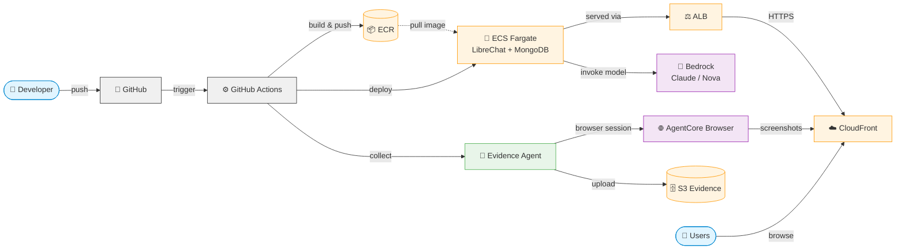
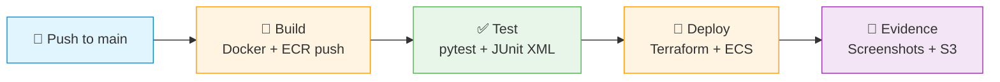
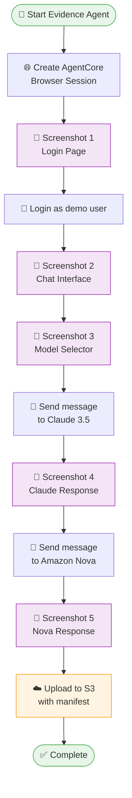

# Evidence Pipeline Chat App

A CI/CD evidence collection pipeline that deploys a LibreChat application to AWS and automatically captures visual evidence of each release using Amazon Bedrock AgentCore Browser.

## What This Does

On every merge to `main`, a GitHub Actions pipeline:
1. Builds the LibreChat Docker image and pushes to ECR
2. Runs unit tests and generates a JUnit XML report
3. Deploys infrastructure via Terraform and updates the ECS service
4. Launches an AgentCore Browser session to capture screenshots of the live app
5. Uploads all evidence (screenshots, test reports, manifest) to S3

## Architecture



## Pipeline Stages



## Evidence Collection Flow



## Components

| Component | Technology | Purpose |
|---|---|---|
| Chat Application | LibreChat (fork) | Web-based chat UI with Bedrock AI backend |
| Infrastructure | Terraform | VPC, ECS Fargate, ALB, CloudFront, S3, IAM |
| CI/CD Pipeline | GitHub Actions | Build, test, deploy, evidence collection |
| Evidence Agent | Python + AgentCore Browser | Automated screenshot capture via Playwright |
| LLM Backend | Amazon Bedrock | Cross-region inference (Claude 3.5 Sonnet, Nova) |
| Artifact Store | S3 | Organized evidence storage with JSON manifests |

## S3 Evidence Structure

```
s3://evidence-pipeline-chat-app-evidence/
└── evidence/
    └── {run_id}/
        └── {timestamp}/
            ├── screenshots/
            │   ├── login-page.png
            │   ├── chat-interface.png
            │   ├── model-selector.png
            │   ├── claude-response.png
            │   └── nova-response.png
            ├── reports/
            │   └── report.xml
            └── manifest.json
```

## Security

- **ALB** restricted to CloudFront IPs + allowed CIDRs via security group rules
- **GitHub Actions** authenticates via OIDC (no long-lived AWS credentials)
- **Pipeline** dynamically adds/removes runner IP from ALB SG during run
- **S3 buckets** have public access blocked
- **Terraform state** bucket has versioning and encryption enabled

## Setup

### 1. Bootstrap AWS Resources
```bash
cd terraform/bootstrap
terraform init
terraform apply
```
Creates: ECR repo, state bucket, evidence bucket, OIDC role.

### 2. Set GitHub Secrets
| Secret | From Bootstrap Output |
|---|---|
| `AWS_ROLE_ARN` | `github_actions_role_arn` |
| `ECR_REPOSITORY_URL` | `ecr_repository_url` |
| `S3_BUCKET_NAME` | `evidence_bucket_name` |
| `TERRAFORM_BACKEND_BUCKET` | `terraform_state_bucket` |

### 3. Push to Main
```bash
git push origin main
```
Pipeline triggers automatically and runs all 4 stages end-to-end.
